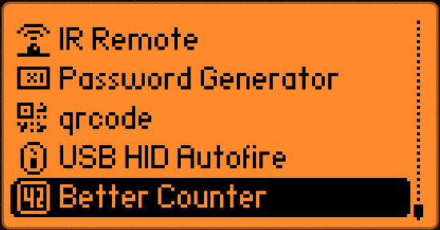
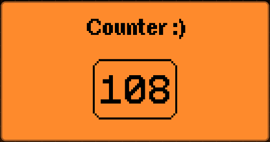

# Dolphin Better Counter
This is a simple external application for the [Flipper Zero](https://www.flipperzero.one).
It gives you access to a counter which you can increment and decrement using the up and down buttons respectively.

# How to install this?
- Clone this repository and copy the directory and it's contents to `<firmware directory>/applications_user/`
- Run `./<firmware directory>/fbt fap_better_counter`
- Upload application binary `better_counter.fap` (e.g. at `<firmware directory>/build/f7-firmware-D/.extapps/better_counter.fap`) to your Flipper Zero
- Or just upload the precompiled binary found at `/APIv11.5_build/better_counter.fap` to your Flipper Zero
